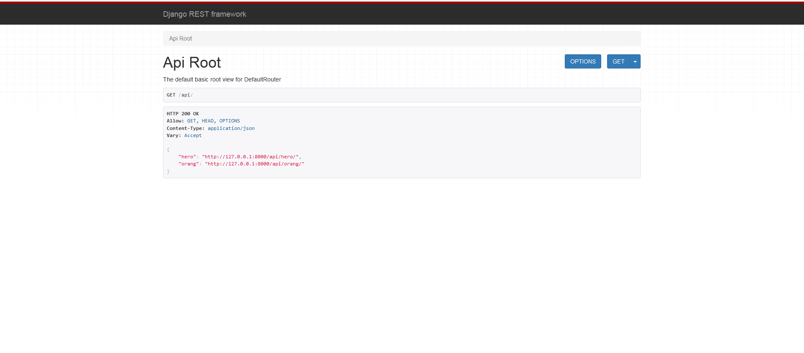

# Pengguna Karakter

## Using

- Python 3.7.9
- cx-Oracle 7.2.3
- Django 2.2.27
- django-cors-headers 3.11.0
- django-filter 21.1
- djangorestframework 3.13.1
- oracle database 12c 12.1.0.1.0

## Setup

``` python
python manage.py makemigrations
```
``` python
python manage.py migrate
```
``` python
python manage.py runserver
```

## ScreenShot
http://127.0.0.1:8000/api/

